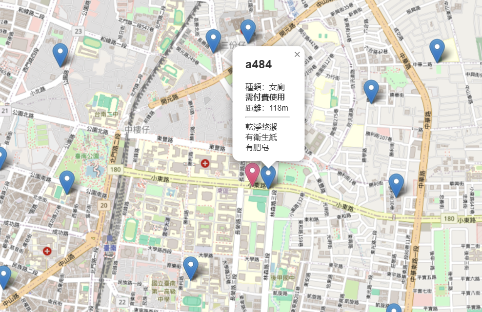
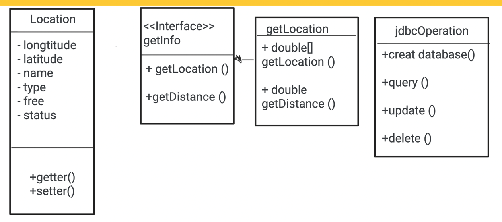
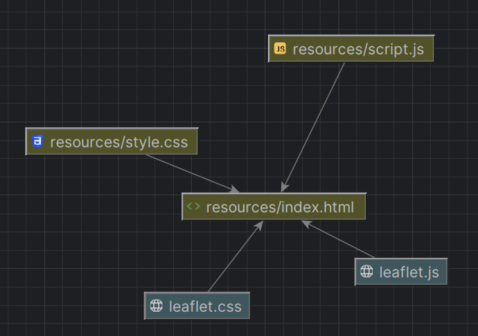
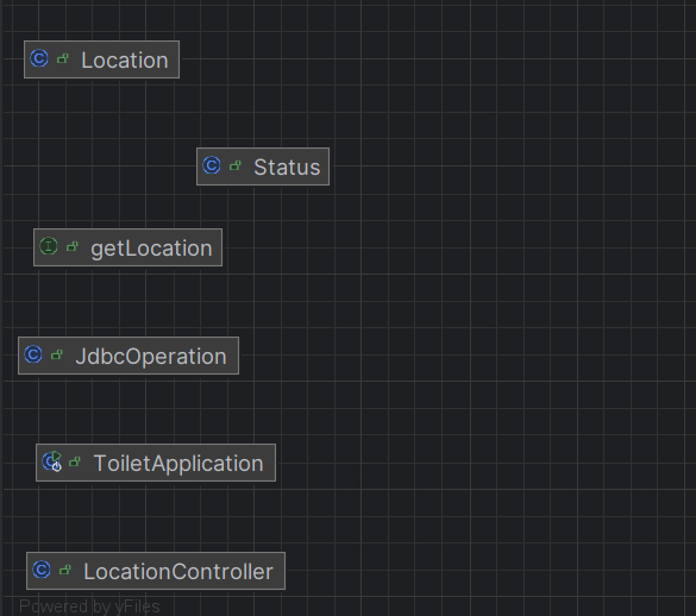

# [112_2 Program Design II] Final Group Project

## Main goal
- Help hosts to easily manage the information of the toilets
- Help users to track the nearby toilets

## Before running
- The complete project is in the branch 'winston-backend' 
- Installed xmapp or mysql before running

---

## Brief Introduction
When nature calls, it becomes even more pressing while traveling in a foreign land. 

 Finding a public restroom in an unfamiliar country is not too difficult, but in today's era of quality living, having certain expectations for restrooms is only natural. 
Not every public restroom meets everyone's needs—factors such as cleanliness, fees, and gender-friendliness can all play a role in one's decision. 

 Our team aims to develop a website that allows users to search for nearby public restrooms based on their preferences, helping them choose the most suitable option.

### Main function we achieve
- Users could create and upload the new information of the toilets to our website
- Users could get the recent information when they load our website 

### Demo
- Red pin: User
- Blue pins: Toilets
- AddFunction: Add the new toilet pins on the map and create the information by clicking the add button
- GetFunction: Get all the information and locate on the map when load in

## Descriptions
### - Some new skills we 've learn in this project
- Backend
  - Java
  - SpringBoot
  - JDBC - SQL
- Frontend
  - HTML
  - JS
- Collaboration
  - Github

### - Some free tools
- TGOS MAP API Lite(Web)
  - [https://data.gov.tw/dataset/31960](https://api.tgos.tw/TGOS_MAP_API/docs/site/web/LiteInit)
- DataBase
  - XAMPP

---
## Draft UML Diagram

---
## Ultimate UML Diagram

## Future Development Directions
- "EDIT" function
- The paths to the toilets
- Rating and Review system
- more detailed information
